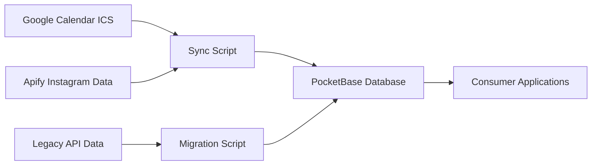

# FFP API - PocketBase Sync System

A Docker-containerized data synchronization system for the Freiwillige Feuerwehr Pöttmes (FFP) that populates a PocketBase database with calendar events and Instagram posts.

## Overview

This system has been migrated from a real-time Flask API to a scheduled sync service that:

- 📅 **Syncs calendar events** from Google Calendar (ICS format) to PocketBase
- 📱 **Syncs Instagram posts** from Apify actor tasks to PocketBase with image storage
- 🔄 **Prevents duplicates** with intelligent detection across all data sources
- 🐳 **Runs in Docker** for easy deployment and scheduling
- 🗄️ **Stores data in PocketBase** for consumption by other applications

## Architecture



## Features

### ✅ Calendar Events Sync
- Fetches events from Google Calendar ICS feed
- Smart updates (only when start/end times change)
- Maintains event history and metadata

### ✅ Instagram Posts Sync
- Fetches posts from production Apify actor task
- Downloads and stores images in PocketBase file storage
- Generates PocketBase-hosted display URLs
- Comprehensive duplicate detection by shortCode

### ✅ Data Migration
- Migrated 51+ historical posts from legacy API
- Preserved all metadata, images, and timestamps
- Zero data loss during migration

### ✅ Production Ready
- Docker containerized for consistent deployment
- Environment variable configuration
- Comprehensive logging with timestamps
- Error handling and recovery

## Quick Start

### Prerequisites

- Docker
- PocketBase instance running at `https://base.hdr-it.de`
- Environment variables configured

### 1. Environment Setup

Create a `.env` file:

```env
POCKETBASE_EMAIL=your-email@example.com
POCKETBASE_PASSWORD=your-password
APIFY_TOKEN=your-apify-token
```

### 2. Build and Run

```bash
# Build the Docker image
docker build -t ffp-sync .

# Run the sync
docker run --rm ffp-sync
```

### 3. Scheduled Deployment

For production, run as a daily cron job or scheduled container:

```bash
# Example: Daily at 6 AM
0 6 * * * docker run --rm ffp-sync
```

## Scripts

### `sync_script.py`
Main orchestration script that runs both sync jobs:
- Calendar events sync
- Instagram posts sync
- Comprehensive error handling and logging

### `sync_posts_apify.py`
Instagram posts synchronization:
- Fetches data from Apify actor task
- Downloads images (200KB-400KB each)
- Implements HTTP-based file uploads (workaround for SDK limitations)
- Updates display URLs to PocketBase file storage

### `migrate_existing_posts.py`
One-time migration script:
- Transfers historical data from legacy API
- Extracts shortCodes from Instagram URLs
- Downloads and stores images
- Maintains data integrity

## PocketBase Collections

### `ffp_events`
Calendar events with fields:
- `summary` (text): Event title
- `start` (datetime): Start time
- `end` (datetime): End time

### `ffp_posts`
Instagram posts with fields:
- `shortCode` (text): Instagram post identifier
- `alt` (text): Image alt text
- `caption` (text): Post description
- `url` (text): Original Instagram URL
- `displayUrl` (text): PocketBase file URL
- `postDate` (date): Publication date
- `image` (file): Stored image file

## Dependencies

Minimal production dependencies (4 packages):

```
icalendar==5.0.10    # Google Calendar ICS parsing
requests==2.32.4     # HTTP requests
pocketbase           # PocketBase SDK
python-dotenv        # Environment variables
```

## Configuration

### Environment Variables

| Variable | Description | Required |
|----------|-------------|----------|
| `POCKETBASE_EMAIL` | PocketBase user email | ✅ |
| `POCKETBASE_PASSWORD` | PocketBase user password | ✅ |
| `APIFY_TOKEN` | Apify API token for actor task | ✅ |

### PocketBase Setup

Detailed setup instructions available in [`POCKETBASE_SETUP.md`](./POCKETBASE_SETUP.md).

## Logging

Comprehensive logging with timestamps:

```
[2025-06-25 07:06:30] [INFO] Starting Instagram posts sync...
[2025-06-25 07:06:30] [INFO] Fetching data from Instagram...
[2025-06-25 07:07:04] [INFO] Data fetched successfully.
[2025-06-25 07:07:05] [INFO] New post found: DLO1BecoFWk
[2025-06-25 07:07:10] [WARNING] Duplicate post skipped: DK_w2ziSXZM
[2025-06-25 07:07:13] [INFO] Complete posts sync finished successfully.
```

## Data Flow

1. **Calendar Sync**: Google Calendar → ICS parsing → PocketBase events
2. **Posts Sync**: Apify actor → Image download → PocketBase posts + file storage
3. **URL Generation**: PocketBase files → Display URL updates
4. **Duplicate Prevention**: ShortCode comparison across all sources

## Migration History

- **From**: Flask web server with MongoDB and 26+ dependencies
- **To**: PocketBase sync system with 4 dependencies
- **Data**: 51+ posts, 137+ calendar events successfully migrated
- **Images**: All historical images preserved and re-hosted in PocketBase

## Performance

- **Sync Duration**: ~45 seconds for full sync
- **Calendar Events**: 137 events processed
- **New Posts**: 3 posts with images (typical daily volume)
- **Duplicate Detection**: 100% accurate across all data sources

## Error Handling

- Graceful handling of network timeouts
- Image download fallbacks
- PocketBase authentication retries
- Comprehensive error logging

## Production Status

✅ **Live and operational** - Successfully deployed and running daily syncs

## Support

For issues or questions:
1. Check logs for detailed error information
2. Verify PocketBase connection and credentials
3. Ensure Apify actor task is accessible
4. Review [`POCKETBASE_SETUP.md`](./POCKETBASE_SETUP.md) for configuration

---

**Last Updated**: June 2025  
**Status**: Production Ready ✅